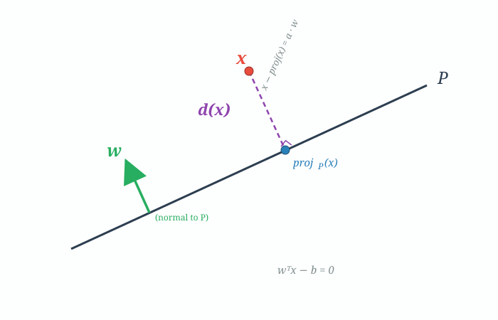
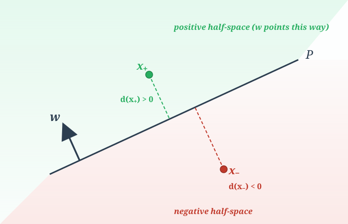
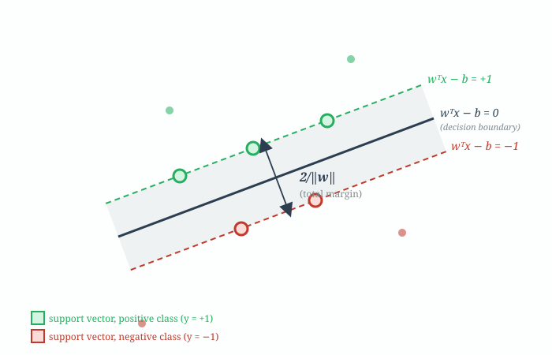

# Problem 1 — Point-to-Plane Distance

**Source notebook:** `assigments/ml-kernel-methods/kernel_methods_1-4.ipynb` cells 3–4.

**What's proved:** The signed distance from a point $\mathbf{x}$ to the hyperplane $P:\; \mathbf{w}^T\mathbf{x} - b = 0$ is

$$d(\mathbf{x}) = \frac{\mathbf{w}^T\mathbf{x} - b}{\|\mathbf{w}\|}.$$

---

## 0. Why you should care about this little formula

This looks like a one-line geometry result, but it's the single fact that justifies the entire Support Vector Machine objective. Specifically:

- The "margin" of an SVM is literally the smallest distance from any training point to the decision hyperplane, measured by this exact formula.
- Setting the constraint $y_i(\mathbf{w}^T\mathbf{x}_i - b) \geq 1$ is only "the margin is at least $1/\|\mathbf{w}\|$" in disguise — the $1/\|\mathbf{w}\|$ comes from the denominator below.
- Maximizing the margin $\Leftrightarrow$ minimizing $\|\mathbf{w}\|^2$. The $\|\mathbf{w}\|^2$ in the SVM objective is there because Problem 1 is true.

So: understand Problem 1 first, and the rest of kernel SVM derivations stop feeling arbitrary.

---

## 1. The geometric picture

What the picture shows:

- The solid diagonal line is the hyperplane $P$ (in 2D a line, in $n$-D an $(n-1)$-dimensional affine subspace).
- The green arrow is the **normal vector** $\mathbf{w}$. Why it ends up perpendicular to $P$ is derived in §1.1 below.
- The red dot $\mathbf{x}$ is some point in space — off the plane, in general.
- The blue dot $\text{proj}_P(\mathbf{x})$ is the **orthogonal projection** of $\mathbf{x}$ onto $P$: the unique point on $P$ that is closest to $\mathbf{x}$.
- The purple dashed segment from $\mathbf{x}$ to $\text{proj}_P(\mathbf{x})$ is what we're trying to measure — its length is $d(\mathbf{x})$.
- **The key fact hiding in the picture:** that dashed segment is perpendicular to $P$ (also argued in §1.1), which means it is *parallel to $\mathbf{w}$*. That is the crack we pry the whole proof open with.

### 1.1 Three geometric facts to lock in

Before the algebra starts, it's worth pinning down exactly what the picture is claiming. Three facts the proof relies on, and — importantly — which ones are definitions versus which ones are quick derivations.

**Fact 1 — $\mathbf{w}$ is perpendicular to $P$.**

This is a two-line consequence of the plane equation, not quite "by definition" even though many texts call it that. Take any two points $\mathbf{y}_1, \mathbf{y}_2 \in P$. Both sit on the plane, so both satisfy:

$$\mathbf{w}^T\mathbf{y}_1 = b, \qquad \mathbf{w}^T\mathbf{y}_2 = b.$$

Subtract one from the other:

$$\mathbf{w}^T(\mathbf{y}_1 - \mathbf{y}_2) = 0.$$

The vector $(\mathbf{y}_1 - \mathbf{y}_2)$ is a direction lying *inside* the plane — it goes from one point on $P$ to another. Its dot product with $\mathbf{w}$ is zero, so $\mathbf{w}$ is perpendicular to that direction. Since this holds for *any* two points on $P$, $\mathbf{w}$ is perpendicular to every direction you can travel within $P$ — which is the definition of "normal to $P$."

**Fact 2 — $\text{proj}_P(\mathbf{x})$ is a point, not a direction.**

A subtle source of confusion: $\text{proj}_P(\mathbf{x})$ is a **point** on the plane, not a vector. Points aren't perpendicular to things — only vectors, lines, and line segments can be perpendicular. So when we talk about "perpendicular to $P$" in the context of the projection, what we really mean is the **displacement vector** from $\mathbf{x}$ to that point:

$$\mathbf{x} - \text{proj}_P(\mathbf{x}).$$

It's this *vector* (the dashed purple segment in the picture) that is perpendicular to $P$ — not the point itself.

**Fact 3 — The displacement $\mathbf{x} - \text{proj}_P(\mathbf{x})$ is perpendicular to $P$.**

This one depends on which definition of "orthogonal projection" you're using. We defined it as the *closest* point on $P$ to $\mathbf{x}$, so perpendicularity is a **theorem**, not a definition. The argument:

> Suppose the segment from $\mathbf{x}$ to $\text{proj}_P(\mathbf{x})$ were *not* perpendicular to $P$. Then the segment has some non-zero component along a direction that lives inside $P$. Sliding $\text{proj}_P(\mathbf{x})$ a tiny bit in that direction gives a *new* point on $P$ that is strictly closer to $\mathbf{x}$ — contradicting the assumption that $\text{proj}_P(\mathbf{x})$ was the closest point to begin with. So the segment must be perpendicular to $P$.

Some textbooks flip this and *define* the orthogonal projection as "the foot of the perpendicular from $\mathbf{x}$ to $P$" — under that definition, perpendicularity is built in, and "it's also the closest point" becomes the theorem to prove. Both approaches describe the same point. They're two sides of the same coin, not competing claims.

**Putting Facts 1 and 3 together.** Both $\mathbf{w}$ and $\mathbf{x} - \text{proj}_P(\mathbf{x})$ are perpendicular to $P$. In an $n$-dimensional space containing an $(n{-}1)$-dimensional plane, the set of all directions perpendicular to the plane is a **one-dimensional line**. So any two such directions must be scalar multiples of each other:

$$\mathbf{x} - \text{proj}_P(\mathbf{x}) = a\,\mathbf{w} \qquad \text{for some } a \in \mathbb{R}.$$

This is the single geometric fact that powers the whole proof. §1.2 below clarifies one piece of notation ($b$) that shows up in Step 3, and then the proof itself is pure algebra.

### 1.2 What is $b$?

$b$ is the plane's **offset** or **intercept** — the constant that controls where the plane sits along the direction of $\mathbf{w}$. It's the single most under-explained symbol in SVM notation, so worth pinning down before the algebra starts.

**Algebraically.** Rewriting the plane equation:

$$\mathbf{w}^T\mathbf{x} - b = 0 \;\;\Longleftrightarrow\;\; \mathbf{w}^T\mathbf{x} = b.$$

So $b$ is the value that the dot product $\mathbf{w}^T\mathbf{x}$ takes whenever $\mathbf{x}$ sits on the plane. Points off the plane give dot products bigger or smaller than $b$ — we exploit that later, in Step 3 of the proof.

**Geometrically.** Divide the plane equation by $\|\mathbf{w}\|$:

$$\underbrace{\left(\tfrac{\mathbf{w}}{\|\mathbf{w}\|}\right)^{\!T}\mathbf{x}}_{\text{signed projection of }\mathbf{x}\text{ onto the unit normal}} \;=\; \underbrace{\tfrac{b}{\|\mathbf{w}\|}}_{\text{a constant}}.$$

The left side is "how far along the direction $\mathbf{w}$ is the point $\mathbf{x}$, measured from the origin." The plane is the set of all points where this equals $b/\|\mathbf{w}\|$. So:

$$\boxed{\;\dfrac{b}{\|\mathbf{w}\|} \;=\; \text{signed distance from the origin to the plane along }\mathbf{w}\;}$$

Three cases:

- $b = 0$ — the plane passes through the origin.
- $b > 0$ — the plane is shifted in the direction $\mathbf{w}$ points, a distance $b/\|\mathbf{w}\|$ away.
- $b < 0$ — the plane is shifted the other way.

**A concrete 2-D example.** Let $\mathbf{w} = (1, 0)$ and $b = 3$. The plane equation becomes

$$1 \cdot x_1 + 0 \cdot x_2 - 3 = 0 \;\;\Longleftrightarrow\;\; x_1 = 3.$$

That's the vertical line $x_1 = 3$. The normal $\mathbf{w} = (1, 0)$ points along the positive $x_1$-axis, and the line sits exactly 3 units from the origin in that direction. Formula check: $b/\|\mathbf{w}\| = 3/1 = 3$. ✓

Another: $\mathbf{w} = (1, 1)$, $b = 2$. The plane is the diagonal line $x_1 + x_2 = 2$. Signed distance from origin: $b/\|\mathbf{w}\| = 2/\sqrt{2} = \sqrt{2}$. The closest point on that line to the origin is $(1, 1)$, which is indeed at distance $\sqrt{2}$. ✓

**Why $b$ has to exist.** Without $b$, the plane equation would be $\mathbf{w}^T\mathbf{x} = 0$, which forces the plane to pass through the origin. That would make SVMs (and most linear classifiers) useless for real data — you can't separate two classes with a hyperplane through $(0, 0, \dots, 0)$ unless one class happens to straddle it. Adding $b$ gives the plane freedom to sit anywhere along the $\mathbf{w}$ direction. This is why $b$ is called the **bias** or **intercept** in machine-learning literature — same role as the intercept in linear regression ($y = wx + b$).

**Sign-convention warning.** You'll see both forms in different references:

$$\mathbf{w}^T\mathbf{x} - b = 0 \qquad\text{and}\qquad \mathbf{w}^T\mathbf{x} + b = 0.$$

They're the same equation with opposite sign conventions for $b$ (our $b$ is their $-b$). The notebook and this walkthrough use the **minus** form, matching scikit-learn's SVM documentation. It's arbitrary — pick one and stay consistent throughout your work.

---

## 2. The proof in four small steps

The proof is short once you see the structure. It's the *why* behind each step that matters more than the mechanics.

### Step 1 — Write the displacement as $a\mathbf{w}$

**Why this step exists.** We want the distance $\|\mathbf{x} - \text{proj}_P(\mathbf{x})\|$, but $\text{proj}_P(\mathbf{x})$ is a vector we don't know yet. If we can express the displacement in terms of something we *do* know — here, the normal $\mathbf{w}$ — we reduce the problem to finding a single scalar.

$$\mathbf{x} - \text{proj}_P(\mathbf{x}) = a \mathbf{w} \qquad \text{for some } a \in \mathbb{R}. \tag{1}$$

The unknown has shrunk from a whole vector $\text{proj}_P(\mathbf{x})$ down to one number $a$. Also, from (1) the distance is

$$d(\mathbf{x}) = \|a\mathbf{w}\| = |a|\cdot\|\mathbf{w}\|,$$

so if we find $a$, we're done.

### Step 2 — Take the dot product with $\mathbf{w}$ on both sides

**Why this step exists.** Equation (1) is a vector equation — it has $n$ scalar components in $n$-D, and we only need one scalar out of it. Any projection onto a 1-D subspace collapses the equation to a scalar. The smart choice is to project onto $\mathbf{w}$ itself, because:

1. $\mathbf{w}^T\mathbf{w} = \|\mathbf{w}\|^2$ — clean right-hand side.
2. $\mathbf{w}^T \text{proj}_P(\mathbf{x})$ will become something we know in Step 3 because of the plane equation.

Taking the dot product of (1) with $\mathbf{w}$:

$$\mathbf{w}^T\mathbf{x} - \mathbf{w}^T \text{proj}_P(\mathbf{x}) = \mathbf{w}^T(a\mathbf{w}) = a\|\mathbf{w}\|^2. \tag{2}$$

### Step 3 — Use "the projection lies on the plane"

**Why this step exists.** The second term on the LHS of (2), $\mathbf{w}^T \text{proj}_P(\mathbf{x})$, is still written in terms of the unknown projection. But we know one thing about $\text{proj}_P(\mathbf{x})$: it is a point *on* $P$. That means it satisfies the plane equation by definition:

$$\mathbf{w}^T \text{proj}_P(\mathbf{x}) - b = 0, \quad \text{i.e.,}\quad \mathbf{w}^T \text{proj}_P(\mathbf{x}) = b. \tag{3}$$

Substitute (3) into (2):

$$\mathbf{w}^T\mathbf{x} - b = a\|\mathbf{w}\|^2. \tag{4}$$

Notice that the unknown projection has been eliminated. The equation now only contains known quantities ($\mathbf{x}, \mathbf{w}, b$) and the scalar we want ($a$).

### Step 4 — Solve for $a$ and assemble the distance

Dividing (4) by $\|\mathbf{w}\|^2$:

$$a = \frac{\mathbf{w}^T\mathbf{x} - b}{\|\mathbf{w}\|^2}.$$

Distance is $|a|\cdot\|\mathbf{w}\|$:

$$d(\mathbf{x}) = |a|\cdot\|\mathbf{w}\| = \frac{|\mathbf{w}^T\mathbf{x} - b|}{\|\mathbf{w}\|^2}\cdot\|\mathbf{w}\| = \frac{|\mathbf{w}^T\mathbf{x} - b|}{\|\mathbf{w}\|}.$$

Dropping the absolute value gives the **signed** distance:

$$\boxed{\; d(\mathbf{x}) = \dfrac{\mathbf{w}^T\mathbf{x} - b}{\|\mathbf{w}\|}\;} \qquad\blacksquare$$

---

## 3. Why it's a *signed* distance, and why that matters

The quantity $\mathbf{w}^T\mathbf{x} - b$ is positive, zero, or negative depending on which side of the plane $\mathbf{x}$ sits:

- On the side that the normal $\mathbf{w}$ points into, $\mathbf{w}^T\mathbf{x} > b$, so $d(\mathbf{x}) > 0$.
- On the opposite side, $\mathbf{w}^T\mathbf{x} < b$, so $d(\mathbf{x}) < 0$.
- Exactly on the plane, $d(\mathbf{x}) = 0$.

**Why this matters for classification.** A linear classifier looks at the sign of the signed distance:

$$\hat{y}(\mathbf{x}) = \mathrm{sgn}\bigl(\mathbf{w}^T\mathbf{x} - b\bigr).$$

Same numerator as $d(\mathbf{x})$. We just use the sign (which side) rather than the full magnitude. The unsigned (always non-negative) distance is $|d(\mathbf{x})|$.

> **Memory hook:** one formula gives you *two* things — its sign is the class label, its magnitude (divided by $\|\mathbf{w}\|$) is the geometric distance to the boundary. SVMs exploit both.

---

## 4. The link to the SVM margin (why this is Problem 1 and not Problem 37)

In the canonical soft-margin SVM, the positive class has the constraint

$$y_i \bigl(\mathbf{w}^T\mathbf{x}_i - b\bigr) \;\geq\; 1, \quad y_i \in \{-1, +1\}.$$

Divide both sides by $\|\mathbf{w}\|$:

$$y_i \cdot d(\mathbf{x}_i) \;\geq\; \frac{1}{\|\mathbf{w}\|}.$$

Read this in English: *every correctly classified training point is at geometric distance at least $1/\|\mathbf{w}\|$ from the decision boundary, on the correct side.* The SVM margin — the distance from the decision plane to the closest support vector — is exactly $1/\|\mathbf{w}\|$. The total "corridor" between the two margin boundaries is $2/\|\mathbf{w}\|$.

**So "maximize the margin"** means **"maximize $1/\|\mathbf{w}\|$"** means **"minimize $\|\mathbf{w}\|$"** means **"minimize $\tfrac{1}{2}\|\mathbf{w}\|^2$"** (the $\tfrac{1}{2}$ and the square are just for convenience when taking derivatives).

The picture shows what this looks like:

- Solid black line: the decision boundary $\mathbf{w}^T\mathbf{x} - b = 0$.
- Green dashed line: $\mathbf{w}^T\mathbf{x} - b = +1$ (positive margin boundary).
- Red dashed line: $\mathbf{w}^T\mathbf{x} - b = -1$ (negative margin boundary).
- Circles on the dashed lines: support vectors — training points that achieve the minimum distance.
- Faint dots further out: non-support-vector training points.
- The double-headed arrow across the shaded strip is labeled $2/\|\mathbf{w}\|$: the total width.

Every single "$1$" and "$1/\|\mathbf{w}\|$" you see in SVM derivations traces back to Problem 1. Without the point-to-plane formula, the margin has no units and $\|\mathbf{w}\|$ has no geometric meaning.

---

## 5. Common pitfalls / "why didn't they just …?"

A few things that tripped me up when I first read this proof:

1. **"Why not project $\mathbf{x}$ onto $\mathbf{w}$ directly?"** — Because $\mathbf{w}$ goes through the origin, not through the plane. The plane is offset by $b$. The projection of $\mathbf{x}$ onto the direction $\mathbf{w}$ would give you the distance of $\mathbf{x}$ from the origin along $\mathbf{w}$, not from the plane. The "$- b$" term in the numerator is exactly the correction for the offset.

2. **"Why is $\mathbf{w}^T \text{proj}_P(\mathbf{x}) = b$?"** — Because $\text{proj}_P(\mathbf{x})$ lies on $P$ by definition (it's a point on the plane), and any point $\mathbf{y}$ on $P$ satisfies $\mathbf{w}^T\mathbf{y} - b = 0$, i.e., $\mathbf{w}^T\mathbf{y} = b$. It's the plane equation, not a separate fact.

3. **"Is $a$ positive or negative?"** — $a$ has whatever sign the signed distance has. If $\mathbf{x}$ is on the side $\mathbf{w}$ points to, $a > 0$. On the other side, $a < 0$. The proof never takes an absolute value until the very last step where we interpret $|a|\cdot\|\mathbf{w}\|$ as the *unsigned* distance.

4. **"What if $\|\mathbf{w}\| = 0$?"** — Then there is no plane. $\mathbf{w} = \mathbf{0}$ makes the plane equation $-b = 0$, which is either degenerate (if $b = 0$, every point is on "the plane") or empty (if $b \neq 0$). We implicitly assume $\|\mathbf{w}\| > 0$ throughout.

5. **Scale ambiguity.** If you multiply both $\mathbf{w}$ and $b$ by the same constant $c \neq 0$, the plane itself doesn't change (it's the same set of points). But the formula is *invariant* to this rescaling: $\mathbf{w}^T\mathbf{x}$ and $b$ both scale by $c$, and $\|\mathbf{w}\|$ also scales by $|c|$, so the ratio is unchanged (up to sign if $c < 0$). This is why SVMs can set the constraint to "$\geq 1$" without loss of generality — they are fixing the scale ambiguity.

---

## 6. Key formula to remember

$$\underbrace{d(\mathbf{x})}_{\text{signed distance}} \;=\; \dfrac{\mathbf{w}^T\mathbf{x} - b}{\|\mathbf{w}\|} \qquad\text{and}\qquad \underbrace{|d(\mathbf{x})|}_{\text{geometric distance}} \;=\; \dfrac{|\mathbf{w}^T\mathbf{x} - b|}{\|\mathbf{w}\|}$$

- **Numerator without absolute value** → signed distance → sign is the classifier's prediction.
- **Numerator with absolute value** → unsigned geometric distance → magnitude is what SVM tries to maximize for the closest points.
- **Denominator $\|\mathbf{w}\|$** → normalizes for the arbitrary scale of $(\mathbf{w}, b)$. Without it, the distance formula would depend on how you happened to write the plane equation.

One sentence to carry in your head: *the signed distance from a point to a hyperplane is the plane's equation, evaluated at the point, divided by the length of the normal vector.*
