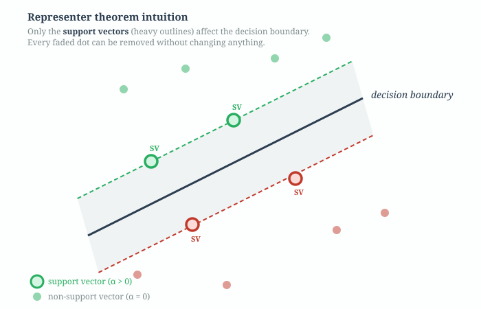
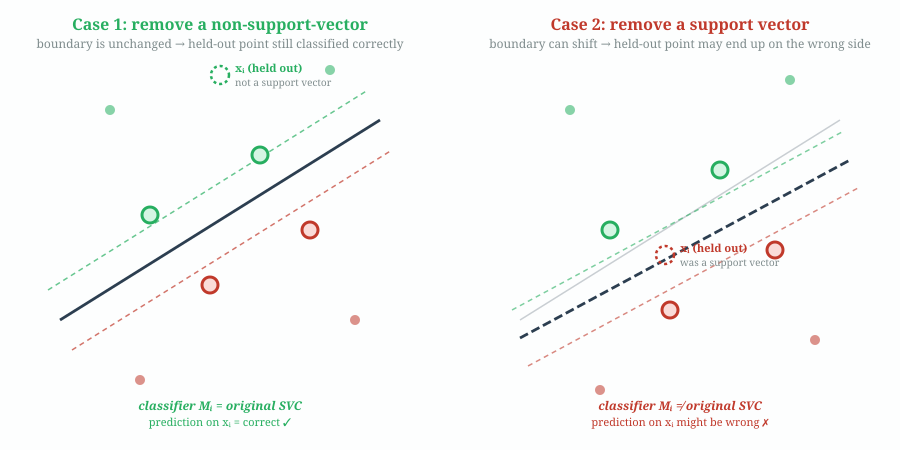
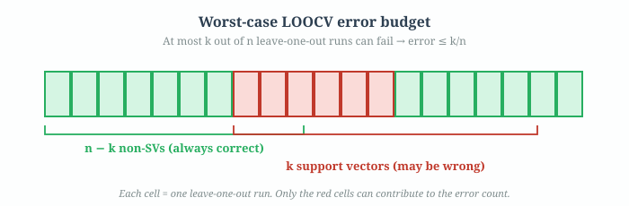

# Problem 2 — LOOCV Generalization Bound

**Source notebook:** `assigments/ml-kernel-methods/kernel_methods_1-4.ipynb` cells 5–6.

**What's proved:** If a Support Vector Classifier is trained on $n$ points and ends up with $k$ support vectors, then the leave-one-out cross-validation error (computed from the training data) is bounded above by

$$\text{LOOCV error} \;\leq\; \frac{k}{n}.$$

---

## 0. Why this result is surprising and useful

Most generalization bounds need a separate validation set. You train on some data, evaluate on held-out data, and that tells you how well the model will generalize. Problem 2 says something stronger:

> **You can bound the generalization error of an SVC using only its number of support vectors — without touching a single test sample.**

The intuition is that an SVC "remembers" only its support vectors. Non-support-vectors could be removed with zero effect. So if you have few support vectors, your model has low effective complexity, and the LOOCV error has a cheap ceiling: $k/n$.

This is why in practice $k/n$ is used as a quick sanity check: if an SVC on 10,000 points has 800 support vectors, the LOOCV generalization error is guaranteed $\leq 8\%$. No cross-validation fold fitting required.

---

## 1. What LOOCV is (quick refresher)

**Leave-one-out cross-validation** on a training set of $n$ points works like this:

For each $i \in \{1, \dots, n\}$:
1. Remove point $\mathbf{x}_i$ from the training set.
2. Train a fresh classifier $M_i$ on the remaining $n-1$ points.
3. Use $M_i$ to predict the label of $\mathbf{x}_i$.
4. Check whether $M_i(\mathbf{x}_i)$ matches the true label $y_i$.

Let $n_{\text{wrong}}$ be the number of $i$ for which $M_i$ got it wrong. The LOOCV error estimate is

$$\text{LOOCV error} = \frac{n_{\text{wrong}}}{n}.$$

That's $n$ retrainings and $n$ single-point predictions. Expensive in general, but mathematically clean for theoretical arguments like this one.

---

## 2. The key insight — the representer theorem

The entire proof rests on one fact about SVMs:

> **The decision boundary of an SVC depends only on its support vectors. Non-support-vectors can be deleted from the training set without changing the classifier at all.**



In the picture above, only the 4 heavy-outlined circles (the support vectors) influence the decision boundary. The 8 faded points could be removed entirely and the SVC would produce the exact same $\mathbf{w}$ and $b$ — and therefore the same predictions for every possible test input.

**Why is this true?** The dual form of the SVM solution expresses the decision function as

$$f(\mathbf{x}) = \sum_{i=1}^n \alpha_i y_i K(\mathbf{x}_i, \mathbf{x}) - b$$

where $\alpha_i \geq 0$ are the dual variables and $K$ is the kernel. Crucially, the KKT conditions force $\alpha_i = 0$ for every training point that is strictly outside the margin (i.e., classified correctly with room to spare). Those $\alpha_i = 0$ terms drop out of the sum. What's left is a sum over the support vectors only — points with $\alpha_i > 0$. This is one instance of the **representer theorem**: the optimal solution lies in the span of the kernel functions evaluated at the training points, and only the "active" ones contribute.

We'll take this as given here; proving it rigorously is a separate exercise. For Problem 2 we only need the consequence: *non-support-vectors are invisible to the decision boundary*.

---

## 3. The proof, in plain English

The argument is a case analysis over "what happens when we hold out the $i$-th training point in LOOCV":



### Case 1 — $\mathbf{x}_i$ is not a support vector of the original SVC

By the representer theorem, removing a non-support-vector doesn't change the classifier. So the LOOCV classifier $M_i$ **is identical to the original SVC**: same $\mathbf{w}$, same $b$, same decision function.

The original SVC was trained on all $n$ points, including $\mathbf{x}_i$, and presumably classified $\mathbf{x}_i$ correctly (otherwise the hinge loss would be paying a penalty for this point, and it would *become* a support vector — contradiction with the assumption that it wasn't one).

So $M_i$ — which is the same classifier — also classifies $\mathbf{x}_i$ correctly. **No contribution to $n_{\text{wrong}}$.**

### Case 2 — $\mathbf{x}_i$ is a support vector of the original SVC

Now removing $\mathbf{x}_i$ might genuinely change the classifier: $M_i$ can have a different $\mathbf{w}$ and $b$ from the original SVC, because $\mathbf{x}_i$ was actually pulling the hyperplane into its current position. When we drop it, the remaining support vectors might settle into a different optimum.

The new classifier $M_i$ might still get $\mathbf{x}_i$ right, or it might get it wrong. **We have no guarantee either way.** The safest upper bound is "assume the worst" — every support-vector case fails.

### Putting the two cases together

- Non-support-vectors (there are $n-k$ of them): always predicted correctly. Contribution to $n_{\text{wrong}}$: **zero**.
- Support vectors (there are $k$ of them): might each fail. Contribution to $n_{\text{wrong}}$: **at most $k$**.

Therefore

$$n_{\text{wrong}} \;\leq\; k,$$

and dividing both sides by $n$:

$$\boxed{\; \text{LOOCV error} \;=\; \frac{n_{\text{wrong}}}{n} \;\leq\; \frac{k}{n}. \;} \qquad\blacksquare$$



The picture: think of $n$ LOOCV runs as a row of $n$ cells. Non-SV cells (green) are guaranteed safe. SV cells (red) are the only ones that *can* contribute to the error count. Even if every red cell fails — the pessimistic worst case — the error is still $k/n$.

---

## 4. Critical fine print

A rigorous reading catches a few subtleties the proof glosses over. None of them break the result, but knowing them will help you answer "but what if…" questions at the exam.

### 4.1 It's an upper bound, not an exact value

Both the notebook's proof and the statement "cross-validated estimate of the generalization error is $k/n$" are slightly imprecise. What we actually showed is

$$\text{LOOCV error} \;\leq\; \frac{k}{n},$$

a **one-sided bound**. The true LOOCV error will typically be *below* $k/n$ because:

- Many of the $k$ support-vector cases will *not* fail when retrained without that one point.
- Only support vectors *at the margin boundary* that are also critical for positioning the hyperplane will flip.

So $k/n$ is a **conservative estimate**. In Problem 3 the notebook checks this empirically: the actual test errors are much smaller than $k/n$ for each of the 20-class one-vs-rest binary classifiers.

### 4.2 The "original SVC classifies $\mathbf{x}_i$ correctly" assumption

The proof implicitly needs the original SVC to be correct on its training points in Case 1. For a hard-margin SVM on linearly separable data this is guaranteed: the margin constraint forces every training point to the correct side.

For a **soft-margin** SVM, a training point is correctly classified **as long as it's not inside the margin on the wrong side**. If the original SVC has training-time misclassifications, those points all have $\alpha_i = C$ (bound support vectors) — so they *are* support vectors. They are therefore already counted in Case 2's worst-case error budget. The argument survives.

### 4.3 What if $k$ is really small?

If an SVC has very few support vectors, $k/n$ is a strong bound. For example, a linear SVM on 10,000 well-separated points might end up with only 50 support vectors ($k/n = 0.5\%$). That's a very confident generalization guarantee.

Conversely, if nearly every training point is a support vector ($k \approx n$), the bound becomes vacuous: "error is at most $\approx 1$" tells you nothing. This tends to happen with high-dimensional problems like the 20 Newsgroups task in Problem 3, where $p \gg n$ and every point is close to the margin.

### 4.4 Why is this called a "cross-validated estimate"?

Historically, LOOCV is considered *the* most fine-grained cross-validation procedure — $n$-fold CV where every fold is a single held-out point. The notebook's phrasing "a cross-validated estimate of the generalization error from the training data" emphasizes: this bound is computed from the training data alone, using the cross-validation framework. No fresh data needed. That's why Problem 2 is a surprising shortcut.

---

## 5. Where this shows up in Problem 3

Problem 3 does something concrete: it trains SVCs on the 20 Newsgroups dataset with three kernels (linear, RBF, Matérn), then checks that $k/n$ is indeed an upper bound on the held-out test error for individual one-vs-rest binary classifiers.

The notebook (cells 47–54) computes, for a sampled binary classifier:

```
n_wrong_test / n_total_test   vs   k / n_total_train
```

and confirms in every case that the test error is smaller than the training-side bound. That's the empirical validation of Problem 2 — though strictly speaking it's comparing test-set error to a LOOCV bound, which is a slightly different object. In practice they're close and the inequality holds.

---

## 6. Summary in one paragraph

The SVC decision boundary depends only on its support vectors (representer theorem). When you do leave-one-out cross-validation, removing a non-support-vector leaves the classifier unchanged — so it still predicts correctly. Removing a support vector can change the classifier, and in the worst case that retraining predicts the held-out point wrong. Since at most $k$ of the $n$ LOOCV runs involve a support vector, at most $k$ of them can fail, giving

$$\text{LOOCV error} \;\leq\; \frac{k}{n}.$$

One sentence to carry in your head: *the number of support vectors is a budget for how wrong an SVC can be under leave-one-out cross-validation.*
