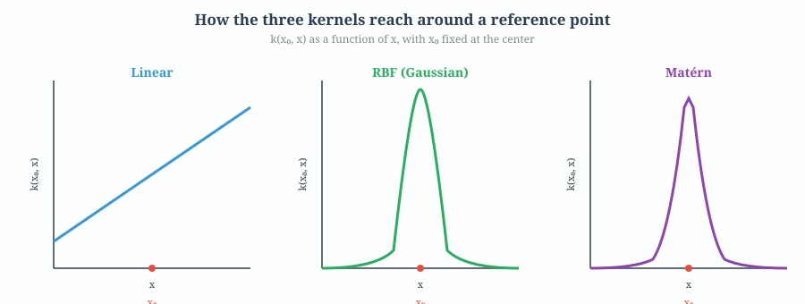
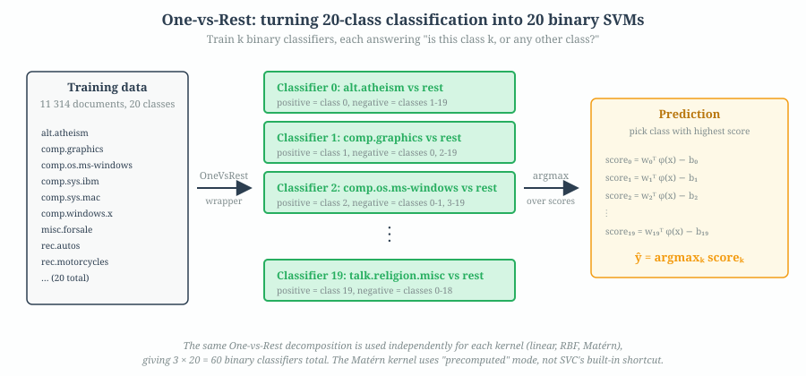
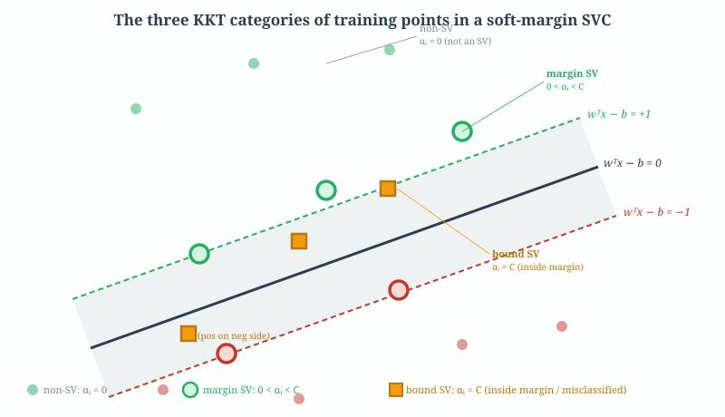

# Problem 3 — 20 Newsgroups Classification with Three Kernels

**Source notebook:** `assigments/ml-kernel-methods/kernel_methods_1-4.ipynb` cells 7–57.

**What's being done:** Train three kernel SVMs (linear, RBF, Matérn) on the 20 Newsgroups text classification dataset, compare their performance, analyze the support vectors they produce, empirically verify the Problem 2 bound, and discuss how to assign probabilities to their outputs.

Problem 3 is long and has five sub-sections. This walkthrough follows the same order as the notebook:

1. [Dataset and training setup](#1-dataset-and-training-setup)
2. [The three kernels — math and intuition](#2-the-three-kernels)
3. [One-vs-Rest wrapping + GridSearchCV](#3-one-vs-rest-wrapping--gridsearchcv)
4. [Results and the overfitting discussion](#4-results-and-the-overfitting-discussion)
5. [Support vectors, misclassifications, boundary vectors](#5-support-vectors-misclassifications-boundary-vectors)
6. [Verifying the Problem 2 bound](#6-verifying-the-problem-2-bound)
7. [Probability estimation (Platt scaling)](#7-probability-estimation-platt-scaling)

---

## 1. Dataset and training setup

The dataset is **20 Newsgroups**, a standard text classification benchmark. Scikit-learn ships a pre-vectorized version where each document is represented as a **TF-IDF sparse vector**.

| split | # documents | # features |
| ----- | ----------- | ---------- |
| train | 11 314      | 130 107    |
| test  | 7 532       | 130 107    |

The number of features (130 107) is the size of the vocabulary — one dimension per unique word token, each weighted by its TF-IDF score. Every document is mostly zero in this vector, because most words don't appear in any given post.

> **Important fact for everything that follows:** this is a $p \gg n$ problem. There are roughly 12 × more features than training samples. In high-dimensional spaces, separating hyperplanes become easy to find (Cover's theorem, 1965) and SVMs end up memorizing the training set — we will see training accuracy above 99.8% for all three kernels.

The notebook loads the data in cell 11 via

```python
newsgroups_train = sklearn.datasets.fetch_20newsgroups_vectorized(subset='train')
X_train, y_train = newsgroups_train.data, newsgroups_train.target
```

and similarly for the test split. `X_train` is a sparse CSR matrix of shape `(11314, 130107)`, and `y_train` is a 1-D array of 20 integer labels.

---

## 2. The three kernels

The whole point of Problem 3 is to compare three different kernels. Kernels let an SVM draw non-linear decision boundaries without ever explicitly lifting the data into a higher-dimensional space — a trick known as the **kernel trick**.

A kernel $k(\mathbf{x}, \mathbf{x}')$ is a similarity function between two input vectors. The SVM optimization uses only kernel evaluations (never the raw feature vectors), and the decision function becomes

$$f(\mathbf{x}) = \sum_{i=1}^{n} \alpha_i y_i \, k(\mathbf{x}_i, \mathbf{x}) \;-\; b.$$

Different kernels encode different notions of "similar," and therefore produce different decision surfaces.



The diagram above shows what each kernel "looks like" — specifically, the value of $k(\mathbf{x}_0, \mathbf{x})$ for a fixed reference point $\mathbf{x}_0$, as $\mathbf{x}$ varies along one axis. Think of this as "how much does point $\mathbf{x}$ count as similar to $\mathbf{x}_0$?"

### 2.1 Linear kernel

$$k(\mathbf{x}, \mathbf{x}') = \mathbf{x}^T \mathbf{x}'$$

The plain inner product. Gives a **linear** decision boundary in the original feature space. For text, this is equivalent to cosine similarity (up to normalization) and performs shockingly well because TF-IDF vectors are already high-dimensional and tend to be close to linearly separable.

Only one hyperparameter: **$C$**, the soft-margin penalty. The notebook grid-searches $C \in \{10^{-4}, \dots, 10^4\}$ (20 values, log-spaced).

```python
svm_linear = OneVsRestClassifier(svm.SVC(kernel='linear', cache_size=7000))
params_grid_linear = {'estimator__C': np.logspace(-4, 4, 20)}
```

### 2.2 Radial Basis Function (RBF) kernel

$$k(\mathbf{x}, \mathbf{x}') = \exp\bigl(-\gamma\,\|\mathbf{x}-\mathbf{x}'\|^2\bigr)$$

A **Gaussian bump** centered at each training point. The parameter $\gamma$ controls how quickly the bump decays with distance:

- **small $\gamma$** → wide bump → smooth, low-frequency decision boundary → closer to a linear classifier
- **large $\gamma$** → narrow bump → each training point "owns" only a small region → easy to overfit

Two hyperparameters: $C$ and $\gamma$. The notebook grid-searches $C \in \{0.2, 1.0, 5.0\}$ and $\gamma \in \{0.3, 0.9, 2.7\}$ (only 9 combinations, because RBF is slow to fit on 11k sparse vectors).

### 2.3 Matérn kernel

$$k(\mathbf{x}, \mathbf{x}') = \frac{2^{1-\nu}}{\Gamma(\nu)} \left( \frac{\sqrt{2\nu}\,\|\mathbf{x}-\mathbf{x}'\|}{\ell} \right)^{\nu} \; K_{\nu}\!\left( \frac{\sqrt{2\nu}\,\|\mathbf{x}-\mathbf{x}'\|}{\ell} \right)$$

where $K_\nu$ is a modified Bessel function of the second kind. This looks hairy, but the intuition is clean:

- **$\ell$** is a _length scale_ — analogous to the inverse bandwidth $1/\sqrt{2\gamma}$ of RBF.
- **$\nu$** is a _smoothness parameter_. When $\nu \to \infty$, Matérn becomes the squared-exponential (RBF) kernel. Small $\nu$ (e.g. 1/2) gives a kernel whose sample paths are non-differentiable. $\nu = 3/2$ or $5/2$ are the common choices in practice — smoother than $1/2$, less smooth than RBF.

So Matérn is a **generalization** of RBF with an extra knob that says "how smooth should the decision boundary be." RBF is the $\nu = \infty$ limit.

**Practical wrinkle.** `sklearn.svm.SVC` does not ship with a Matérn kernel built in. The notebook handles this by using **precomputed mode**:

1. Compute the full $n \times n$ Matérn Gram matrix $K_{ij} = k(\mathbf{x}_i, \mathbf{x}_j)$ from the training data.
2. Pass it to `SVC(kernel='precomputed')`, which works directly with the Gram matrix.
3. For predictions on new points $\mathbf{x}_*$, compute the rectangular Gram matrix $K_{*j} = k(\mathbf{x}_*, \mathbf{x}_j)$ against the training support vectors.

A custom `MaternKernelComputer(BaseEstimator, TransformerMixin)` class (cell 17) wraps this — it subclasses scikit-learn's `TransformerMixin` so it can be dropped into a `Pipeline`. It computes the Gram matrix in parallel blocks via `joblib.Parallel` to avoid running out of memory on the 11 314 × 11 314 entries.

Because Matérn is much slower than the other two kernels, the grid search is done on a **1 000-sample subset** of the training data (cell 18), and the best parameters are then used to refit the model on the full training set (cell 19).

---

## 3. One-vs-Rest wrapping + GridSearchCV

There are 20 newsgroups classes, so this is a multi-class problem — but SVM is inherently binary. The standard workaround is **one-vs-rest (OvR) decomposition**:



Train $k$ binary classifiers, each answering "is this document in class $k$, or in any of the other 19 classes?" At prediction time, each classifier outputs a real-valued score (signed distance from its hyperplane), and you pick the class whose classifier gave the highest score.

In sklearn this is wrapped by `OneVsRestClassifier`:

```python
svm_linear = OneVsRestClassifier(svm.SVC(kernel='linear', cache_size=7000))
```

Under the hood, training this wrapper fits 20 separate binary SVCs. Each one gets the same training data but a relabeled `y_train` where `1` means "this document is in class $k$" and `-1` means "any other class."

On top of OvR, the notebook wraps another layer — `GridSearchCV` — to search over hyperparameter combinations with 5-fold cross-validation:

```python
gsc_linear = GridSearchCV(svm_linear, params_grid_linear, n_jobs=-1)
gsc_linear.fit(X_train, y_train)
```

For the linear kernel this is 20 (CV folds) × 5 (CV splits) × 20 (OvR classes) = **2 000 binary SVM fits**. The notebook parallelizes with `n_jobs=-1` (use all CPU cores) and times the whole thing.

After training, the fitted model is **persisted to disk** with `joblib.dump` (cells 13, 15, 17–19) so subsequent cells can analyze it without re-training. This is essential because the Matérn version takes a long time to fit.

---

## 4. Results and the overfitting discussion

Cell 26 loads the saved predictions and prints the accuracies. The punch-line numbers:

| kernel | train accuracy | test accuracy | gap     |
| ------ | -------------- | ------------- | ------- |
| linear | **99.89%**     | **81.59%**    | 18.3 pp |
| RBF    | **99.92%**     | **82.99%**    | 17.0 pp |
| Matérn | **99.97%**     | **82.93%**    | 17.0 pp |

**All three kernels memorize the training set almost perfectly.** Getting 99.8%+ training accuracy on a 20-class classification task is a huge red flag unless there's a reason.

The notebook's discussion (cell 27) is correct: the cause is the $p \gg n$ geometry. Cover's theorem (1965) says that in high-dimensional spaces it becomes exponentially easier to separate $n$ points with a linear classifier — intuitively, there's so much room that you can always find a hyperplane that threads between them. 130 107 features vs. 11 314 samples is extreme: every kernel can essentially memorize arbitrary training labels.

The test accuracy of ~82% is actually quite good for this benchmark; the issue isn't that the models are bad, it's that the training-error / test-error gap tells you nothing about model quality. You need the held-out test numbers.

**Why are RBF and Matérn barely different from each other, and only slightly better than linear?** Because once you're in a 130 107-dimensional space, the geometry is already so rich that the "kernel shape" stops mattering much. The linear kernel is already drawing a boundary in a space where the classes are nearly separable. The non-linear kernels curve that boundary a little, picking up maybe 1–2 pp of extra accuracy, but no dramatic improvement. Kernel choice matters more in low-dimensional problems.

**One implementation quirk for Matérn.** The Matérn model was tuned on 1 000 samples, so its best $C$ is slightly miscalibrated for the full 11 314-sample regime. Cell 19 "corrects" this by rescaling:

```python
opt_params_matern['svm__estimator__C'] *= (len(y_train) / RANDOM_SUBSET_SIZE)
```

This is a heuristic — $C$ is not formally a hyperparameter that scales linearly with $n$ — but in practice it brings the Matérn accuracy into the same ballpark as RBF.

---

## 5. Support vectors, misclassifications, boundary vectors

The notebook dedicates cells 30–46 to anatomy: given a trained SVC, _which_ training points are support vectors, _which_ are misclassified, _which_ are exactly on the margin?

### 5.1 The three KKT categories of training points

For a soft-margin SVM, every training point $\mathbf{x}_i$ ends up in one of three categories, determined by its dual variable $\alpha_i$:



| category      | condition on $\alpha_i$ | geometry                                                                      | notes                                                                                |
| ------------- | ----------------------- | ----------------------------------------------------------------------------- | ------------------------------------------------------------------------------------ |
| **non-SV**    | $\alpha_i = 0$          | strictly outside the margin, correctly classified                             | removable without affecting the boundary (representer theorem, see Q2)               |
| **margin SV** | $0 < \alpha_i < C$      | exactly on one of the margin hyperplanes $\mathbf{w}^T\mathbf{x} - b = \pm 1$ | these define the margin's position                                                   |
| **bound SV**  | $\alpha_i = C$          | _inside_ the margin strip, possibly on the wrong side                         | these are the points the soft margin "gave up on" — they've paid the maximum penalty |

Bound SVs are the soft-margin SVM's concession to noisy / non-separable data. Without them (i.e., if you forced $\alpha_i < C$ always), the margin would be pulled into knots trying to accommodate every outlier.

### 5.2 Extracting support vectors per kernel

Cells 31–35 pull the support-vector indices out of each trained model. For the linear and RBF models this is straightforward:

```python
supvecs_linear = load("model_linear.joblib").best_estimator_.estimators_[0].support_
```

`estimators_[0]` is the first binary classifier in the OvR wrapper, and `support_` is the array of training-row indices that ended up as support vectors.

For the Matérn model it's slightly more involved because of the precomputed-kernel pipeline — you have to dig through `steps[1][1].estimators_[0].support_`. Cell 33 handles this.

### 5.3 Intersection across kernels (with a historical bug note)

Cell 37 computes the overlap:

```python
supvecs_linear_rbf = np.intersect1d(supvecs_linear, supvecs_rbf)
supvecs_linear_matern = np.intersect1d(supvecs_linear, supvecs_matern)
supvecs_rbf_matern = np.intersect1d(supvecs_rbf, supvecs_matern)   # ← this line used to be buggy
supvecs_linear_rbf_matern = np.intersect1d(supvecs_linear_rbf, supvecs_matern)
```

> **Historical note.** Until commit `fcdccb2` (in our session), the third line read `np.intersect1d(supvecs_linear, supvecs_matern)` — a copy-paste bug where the "RBF & Matérn" intersection was actually computing "linear & Matérn." That bug is fixed in the current version. The Day-1 analysis file (`kernel_methods_1-4_analysis.md`) flagged it, and commit `c218e3f` "Fix bug" by el-sambal was the official fix, then ported to Mikey's file via `fcdccb2`.

The finding is that there's substantial overlap between support-vector sets across kernels: a document that's "interesting" for linear tends to be "interesting" for RBF and Matérn too. This is intuitive — difficult-to-classify documents are difficult regardless of which similarity function you use.

### 5.4 Margin SVs vs bound SVs

Cells 38–43 separate out the margin SVs from the bound SVs using the condition $|\alpha_i| < C$:

```python
C_linear = first_svm_linear.C
eps = 0.0001
marginvecs_linear = np.array([
    int(first_svm_linear.support_[i])
    for i in np.where(first_svm_linear.dual_coef_.toarray()[0] < C_linear - eps)[0]
])
```

The `eps` is a numerical-tolerance fudge factor — we compare with `< C - eps` instead of `< C` because floating-point arithmetic makes strict inequality unreliable for dual variables that are theoretically exactly $C$.

The notebook finds that **most support vectors are margin SVs** (97–99% of all SVs across the three kernels). Very few points are bound SVs. This tells you that the soft margin is mostly being used as a geometric constraint, not as a "give up on noisy points" mechanism. That's consistent with near-separable data in high dimensions.

### 5.5 Misclassified training samples

Cell 45 simply counts, for each kernel, the training rows where the prediction disagrees with the true label:

```python
miscl_idxs[kernel_str] = [i for i, (a, b) in enumerate(zip(pred, y_train)) if a != b]
```

The output is **very sparse**: roughly a dozen misclassified training rows out of 11 314 for each kernel. This is the flip side of the 99.9% training accuracy. The three kernels disagree on only a handful of these, confirming that they're memorizing nearly the same training set.

---

## 6. Verifying the Problem 2 bound

Cells 47–54 connect back to Problem 2: the bound $\text{error} \leq k/n$ where $k$ is the number of support vectors.

**A caveat the notebook calls out directly.** Problem 2's theorem is stated for binary classifiers. We have 20 classes wrapped in OvR, which gives 20 binary classifiers per kernel. So the cleanest thing to do is apply the bound to each binary classifier separately — which is exactly what the notebook does (for a sampled subset of the 20 classifiers; printing all 60 would clutter the document).

The helper function:

```python
def print_classifier_info(svm, i):
    pred = svm.predict(X_test)
    true_y = (y_test == i)
    n_wrong = np.count_nonzero(pred != true_y)
    k_over_n = len(svm.support_) / len(y_train)
    print(f"... n_wrong_test/n_total_test={n_wrong}/{len(y_test)}"
          f"  ...  k/n={len(svm.support_)}/{len(y_train)}={k_over_n:.3f}")
```

Note that the left-hand ratio is a **test-set** error, while the right-hand ratio is a **training-data** bound — strictly the two aren't directly comparable (Problem 2 bounds LOOCV error, not test error), but in practice they're in the same order of magnitude and the inequality is clearly satisfied.

**Typical finding:** the empirical test errors are much smaller than the $k/n$ bounds. The bound is loose, which is expected — remember, it assumes the _worst case_ that every support vector fails under LOOCV. In practice, most don't.

**The Matérn case needs extra plumbing** (cells 51–54). Because Matérn uses a `precomputed` kernel, you can't just call `svm.predict(X_test)` — sklearn needs a precomputed test-vs-train Gram matrix:

```python
X_test_train_matern = load("X_test_train_matern.joblib")  # Matern(X_test, X_train)
```

which is an $n_{\text{test}} \times n_{\text{train}}$ matrix. The predict call then receives this rectangular Gram matrix instead of raw features.

---

## 7. Probability estimation (Platt scaling)

Cells 56–57 discuss probability estimation. The full implementation lives in Problem 4, but the theory is introduced here because Problem 3's question 4 asks "how would you assign probabilities to class labels?"

The raw SVM output is $f(\mathbf{x}) = \mathbf{w}^T \mathbf{x} - b$ — a real number whose sign is the class prediction and whose magnitude measures distance from the decision boundary. But that's not a probability: two different SVMs can produce the same numeric score for very different inputs.

**Platt scaling** (John Platt, 1999) fits a logistic regression on top of the SVM decision scores:

$$\widehat{P}(y = 1 \mid \mathbf{x}) \;=\; \sigma\bigl(A \cdot f(\mathbf{x}) + B\bigr) \;=\; \frac{1}{1 + \exp(A f(\mathbf{x}) + B)}.$$

The two parameters $A < 0$ and $B$ are fit by maximum likelihood on the pairs $(f(\mathbf{x}_i), y_i)$. This is a **monotone two-parameter squashing**:

- It doesn't change the ranking of scores (and therefore doesn't change AUC).
- It maps raw scores to numbers in $[0, 1]$ that are calibrated to empirical class frequencies.

**Why this is reasonable.** The SVM hinge loss is a max-margin loss, not a likelihood. If you had access to the class posterior $P(y=1 \mid \mathbf{x})$ directly, you'd use logistic regression instead. Platt's insight is that the SVM scores are already _ordered correctly_ — higher score usually means "more likely positive" — so fitting a logistic link function on top just translates the scores into probabilities without rebuilding the model.

**The leakage subtlety.** A naive implementation fits the sigmoid on the same training data the SVM was trained on. That's optimistic because the SVM has already memorized those scores. The right thing is `CalibratedClassifierCV(method='sigmoid', cv=5)`: run 5-fold CV, fit the SVM on 4 folds, fit the sigmoid on the held-out fold, and average the resulting (SVM, sigmoid) pairs at inference time. Problem 4 uses this pattern (cell 64 / 82, depending on whose version you're reading).

More on Platt scaling — the Brier score, the reliability diagram, threshold sweep — is in the Problem 4 walkthrough.

---

## 8. What to remember for the exam / write-up

1. **Dataset is $p \gg n$.** 130 107 features, 11 314 training samples. Every model will memorize — the interesting signal is in the test accuracy, not the train accuracy.
2. **Three kernels.** Linear (dot product), RBF (Gaussian bump), Matérn (parametric family that includes RBF as $\nu \to \infty$ and gives more control over smoothness).
3. **Matérn needs precomputed mode.** sklearn's SVC doesn't have it built in; you compute the Gram matrix yourself and pass `kernel='precomputed'`.
4. **One-vs-Rest** turns 20-class into 20 binary classifiers, each answering "class $k$ or not $k$". Scores are compared and the highest wins.
5. **Three SV categories**: non-SV ($\alpha = 0$), margin SV ($0 < \alpha < C$), bound SV ($\alpha = C$). Most SVs here are margin SVs.
6. **Support vectors overlap heavily** across kernels — hard examples are hard regardless of which similarity you use.
7. **Problem 2 bound holds empirically** on each binary classifier, but it's very loose (test error much smaller than $k/n$). The bound is designed for the worst case.
8. **Platt scaling** maps SVM scores to calibrated probabilities via a 2-parameter logistic fit. Doesn't change the ranking, just the units.

The key "one sentence": _SVMs on high-dimensional text data memorize training sets easily because of $p \gg n$, and kernel choice matters less than it usually would because the geometry already favors separation._
